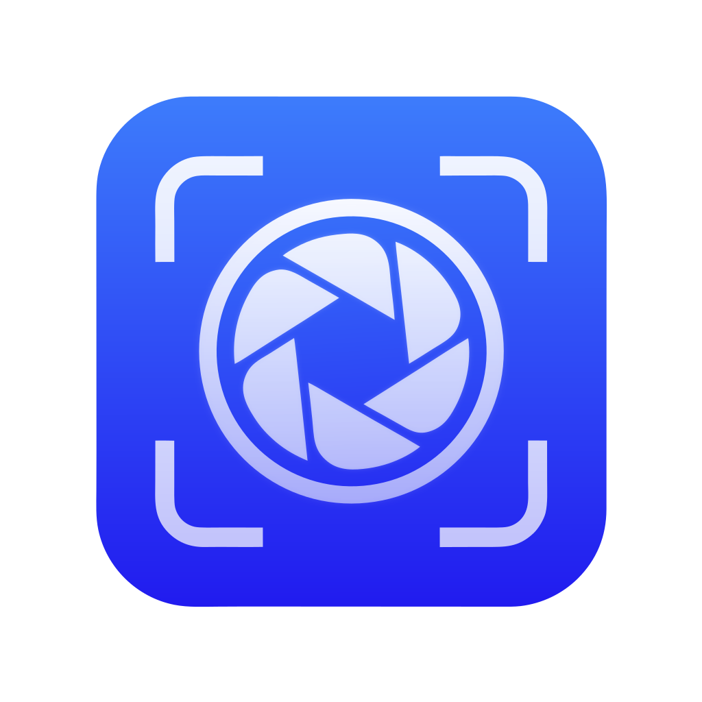

# Snaploom

<p align="center">
  
</p>

<p align="center">
  <strong>Capture, annotate, record, and shape anything on your Mac.</strong>
</p>

Snaploom is a lightweight, native macOS screenshot and screen-recording tool. It combines fast region capture, editable annotations, scrolling screenshots, OCR, recording, and a built-in video editor in one menu-bar app.

<p align="center">
  
</p>

## Highlights

- Capture a region, window, full display, previous selection, or scrolling page.
- Annotate with arrows, shapes, rich text, drawing, markers, measurements, highlights, blur, pixelation, and smart redaction.
- Record a region or display to MP4 or GIF with system audio, microphone, webcam, mouse-click highlights, and keystroke overlays.
- Edit recordings with trim, speed, freeze, zoom, text, censor, and audio controls.
- Extract text and QR codes with Apple Vision; translate on device where supported.
- Save to disk, copy to the clipboard, pin on screen, or reopen captures with editable annotations.
- Export PNG, JPEG, HEIC, WebP, and AVIF.
- Run natively with Swift and AppKit on Apple Silicon and Intel Macs.
- Use any of the bundled 40 interface languages.

## Requirements

- macOS 12.3 Monterey or later
- Xcode 26 or later to build the current source
- Screen Recording permission for capture
- Optional Accessibility and Input Monitoring permissions for scrolling capture and keystroke overlays
- Optional Microphone and Camera permissions for recording

## Build

```bash
git clone https://github.com/xiaoou-waou/Snaploom.git
cd Snaploom
xcodebuild \
  -project Snaploom.xcodeproj \
  -scheme Snaploom \
  -configuration Debug \
  -derivedDataPath build \
  CODE_SIGNING_ALLOWED=NO \
  build
```

The unsigned app is written to `build/Build/Products/Debug/Snaploom.app`. For normal development, open `Snaploom.xcodeproj` in Xcode and choose the `Snaploom` scheme.

## Optional Upload Integrations

- **S3-compatible storage:** configure your endpoint, bucket, region, and credentials in Settings.
- **imgbb:** supply your own API key in Settings. Snaploom does not ship a shared key.
- **Google Drive:** disabled until a maintainer supplies a native OAuth client. Add `GoogleOAuthClientID` to `SnaploomApp/Info.plist` and register its reversed client ID as a URL scheme.

Screenshots and recordings stay local unless you explicitly choose an upload action.

## URL Actions

When enabled in Settings, external tools can invoke actions such as:

```bash
open "snaploom://capture"
open "snaploom://record"
open "snaploom://scroll-capture"
open "snaploom://history"
```

## Project Status

Snaploom starts at version `0.1.0`. Release downloads and signed automatic updates are not published yet; the source build is the supported installation path for this initial repository version.

## Upstream and License

Snaploom is an independent modified distribution based on [macshot](https://github.com/sw33tLie/macshot), imported from upstream commit `270db084796cec47245c0c5fa5ca21b6d222ea76`. It is not affiliated with or endorsed by the upstream project.

The original project and this modified version are licensed under the [GNU General Public License v3.0](LICENSE). Original copyright and contributor attribution remain intact. See [NOTICE.md](NOTICE.md) and [UPSTREAM_CHANGELOG.md](UPSTREAM_CHANGELOG.md).

## Maintainer

Maintained by [xiaoou](https://github.com/xiaoou-waou). Issues and pull requests are welcome.
